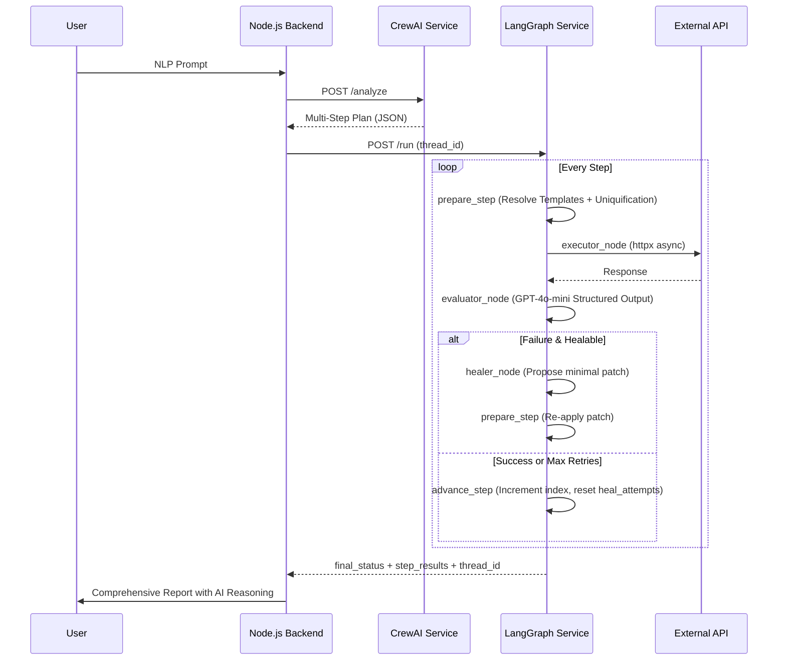

# APIFlow: Deep-Dive Implementation Report
## Autonomous API Testing via LangGraph & CrewAI Orchestration

**Student:** zayimhan  
**Academic Year:** 2025-2026  
**Course:** Advanced Agentic AI  
**Project Status:** Production Ready (v2.0)  
**GitHub:** [zayimhan/ai_powered_api_tester](https://github.com/zayimhan/ai_powered_api_tester)

---

## 1. Executive Summary

APIFlow is a high-fidelity API testing platform built on a **Dual-Agent Architecture**. It replaces legacy sequential automation with a **Self-Healing State Machine** powered by LangGraph. By combining **CrewAI's** strategic planning capabilities with **LangGraph's** resilient execution flow, APIFlow achieves near-human adaptability in automated testing environments.

Both agents coexist in the same repository under separate microservices (`crewai-service/` and `apiflow_langgraph/`) and are orchestrated by a shared Node.js backend. The `USE_LANGGRAPH_EXECUTOR` environment flag controls which engine runs for a given test scenario, allowing both services to operate independently and in combination.

> **Assignment Compliance:** LangGraph was added to the existing project alongside the original CrewAI integration. Both services run concurrently. LangSmith tracing is enabled for all LangGraph executions.

---

## 2. System Architecture: The Planner-Executor Model

The system architecture is divided into two distinct cognitive layers:

### 2.1 The Planner (CrewAI) — `crewai-service/`
- **Role:** Architect / Strategist.
- **Function:** Transforms a natural language prompt (e.g., *"Create a user, login, and send a friend request"*) into a structured JSON Execution Plan.
- **Output:** A list of atomic API steps with descriptions, endpoints, and expected assertions.
- **Endpoint:** `POST /analyze`

### 2.2 The Executor (LangGraph) — `apiflow_langgraph/`
- **Role:** Field Agent / Operator.
- **Function:** Executes the plan step-by-step using a cyclic state machine. It monitors state, evaluates results using LLMs, and performs **Autonomous Healing** if a step fails due to recoverable errors (stale tokens, missing headers, etc.).
- **Endpoints:** `POST /run`, `POST /resume/{thread_id}`, `GET /state/{thread_id}`



---

## 3. LangGraph Core Implementation

### 3.1 Advanced State Management (`state.py`)

A robust state object implemented with `TypedDict` and `Annotated` reducers:

```python
class ScenarioState(TypedDict):
    messages: Annotated[List[Any], add_messages]  # Persistent LLM conversation history
    plan_steps: List[Dict[str, Any]]               # Dynamic plan (healer mutates current step)
    current_step_index: int                        # Step pointer
    context: Dict[str, Any]                        # Shared memory: tokens, userIds, emails
    run_id: str                                    # Uniquification seed
    last_step_result: Optional[Dict[str, Any]]     # Raw HTTP result
    last_step_passed: Optional[bool]
    evaluator_feedback: Optional[str]
    should_heal: bool                              # Routing flag → healer branch
    heal_attempts: int                             # Max 2 retries per step
    _prepared_request_json: Optional[str]          # Temp: prepare → executor handoff
    step_results: List[Dict[str, Any]]             # Accumulator for final report
    final_status: Optional[str]                    # "passed" / "failed" / "halted"
```

- **`add_messages` reducer:** Preserves the full LLM conversation history throughout the graph lifecycle. The Healer node can inspect all prior Evaluator messages for context on previous failures.
- **`_prepared_request_json`:** An ephemeral field used only to pass the fully-resolved request from `prepare_step` to `executor_node` without polluting the shared context.

### 3.2 Structured Output Models (`state.py`)

LangGraph nodes use Pydantic models to enforce LLM output schemas:

```python
class StepEvaluation(BaseModel):
    passed: bool
    feedback: str
    should_heal: bool    # routes the graph to healer branch
    heal_hint: Optional[str]

class HealProposal(BaseModel):
    new_headers: Optional[Dict[str, str]]
    new_body_fields: Optional[Dict[str, Any]]
    explanation: str
```

### 3.3 The 6-Node Graph Topology (`graph.py`)

The graph is a **Directed Cyclic Graph (DCG)** — cycles are intentional and required for the retry/healing loop.

```
START
  │
  ▼
prepare_step ◄────────────────────┐
  │                               │
  ▼                               │
executor_node                     │
  │                               │
  ▼                               │
evaluator_node                    │
  │                               │
  ├─[should_heal=True]──► healer_node
  │                               │
  ├─[passed & more steps]─► advance_step ──► prepare_step
  │
  └─[last step or all failed]──► finalizer_node
                                      │
                                      ▼
                                     END
```

**Node responsibilities:**

| Node | File | Responsibility |
|---|---|---|
| `prepare_step` | `nodes.py:90` | Template resolution, uniquification, token injection |
| `executor_node` | `nodes.py:233` | Async HTTP via `httpx`, captures status/body/timing |
| `evaluator_node` | `nodes.py:254` | Deterministic assertion check → LLM triage if failed |
| `healer_node` | `nodes.py:409` | Proposes minimal header/body patches to fix the request |
| `advance_step_node` | `graph.py:68` | Increments `current_step_index`, resets `heal_attempts` to 0 |
| `finalizer_node` | `nodes.py:463` | Aggregates results, sets `final_status`, logs KPI |

---

## 4. Intelligent Mechanisms & AI Reasoning

### 4.1 Autonomous Self-Healing Flow

The system separates **deterministic failures** (assertion mismatches) from **agentic failures** (request construction issues):

1. **Evaluator** runs deterministic assertions first (fast path, no LLM cost).
2. On failure, if `heal_attempts < 2`, the LLM is queried with `StepEvaluation` structured output.
3. If `should_heal=True`, the **Healer** proposes a `HealProposal` (header/body patch).
4. The patched step re-enters `prepare_step` and is re-executed.
5. After 2 failed heal attempts, the step is marked failed and the graph advances.

```python
# graph.py:52 — Conditional routing after evaluator
def route_after_evaluator_with_advance(state) -> Literal["healer", "advance_step", "finalizer"]:
    if state.get("should_heal"):
        return "healer"
    if state.get("last_step_passed"):
        next_idx = state["current_step_index"] + 1
        if next_idx < len(state["plan_steps"]):
            return "advance_step"
        return "finalizer"
    next_idx = state["current_step_index"] + 1
    if next_idx < len(state["plan_steps"]):
        return "advance_step"
    return "finalizer"
```

### 4.2 Dynamic Variable Injection & Extraction (`nodes.py:550`)

The `_extract_variables` function auto-discovers critical fields from every HTTP response:
- **Auto-keys:** `token`, `access_token`, `accessToken`, `id`, `userId`, `user_id`, `sessionId`
- **Multi-actor support:** Keys are namespaced by actor (e.g., `UserA_token`, `UserB_token`) enabling multi-user test scenarios.
- **Deep search:** Checks `body`, `body.data`, `body.result`, `body.user`, `body.payload`, and all top-level nested objects.

### 4.3 Data Isolation — Uniquification (`nodes.py:154`)

To prevent `409 Conflict` errors in high-frequency testing:
- `email` → `original_actor_<run_id>@domain.com`
- `username` → `original_actor_<run_id>`
- `password` is stored per-actor in context and reused across login steps
- `run_id` is a 6-char hex generated fresh per `/run` invocation

### 4.4 Template Resolution (`template_resolver.py`)

Supports `{{variableName}}` syntax in URLs, headers, and body fields. The resolver walks the entire request config object recursively, substituting from the live `context` dict at execution time.

---

## 5. Resiliency & Observability

### 5.1 Checkpointing & State Recovery (`server.py`)

Using `AsyncSqliteSaver` (local/Railway) or `MemorySaver` (stateless fallback):

```python
# server.py:22 — Lifespan-managed checkpointer
if db_path:
    async with AsyncSqliteSaver.from_conn_string(db_path) as checkpointer:
        _graph = builder.compile(checkpointer=checkpointer)
else:
    checkpointer = MemorySaver()
    _graph = builder.compile(checkpointer=checkpointer)
```

Every state transition is persisted via `thread_id`. The `/resume/{thread_id}` endpoint re-invokes the graph from the exact last checkpoint — zero re-execution of already-passed steps.

**FastAPI Endpoints:**
- `POST /run` — Start new graph execution
- `POST /resume/{thread_id}` — Resume from checkpoint
- `GET /state/{thread_id}` — Inspect live graph state
- `GET /health` — Service health check

### 5.2 LangSmith Tracing

The entire graph is instrumented via environment variables:

```bash
LANGCHAIN_TRACING_V2=true
LANGCHAIN_API_KEY=<key>
LANGCHAIN_PROJECT=apiflow-langgraph
```

LangSmith provides:
- Full LLM call traces (prompts, completions, token costs) for every `evaluator_node` and `healer_node` invocation
- Node execution timings across the graph
- Error traces with full state snapshots
- Production audit trail for compliance/debugging

---

## 6. Integration Layer

### 6.1 Backend (Node.js) Synergy

The Node.js backend selects the execution engine via `USE_LANGGRAPH_EXECUTOR` flag:
- **Legacy path:** Direct Axios calls in `scenario-agent.service.js`
- **Smart path:** `ScenarioAgentService` calls `POST /run` on the LangGraph service

Database schema additions for LangGraph:
- `scenarios.langgraph_thread_id` — links DB record to graph checkpoint
- `scenario_steps.heal_log` — stores healer explanations
- `scenario_steps.evaluator_feedback` — stores LLM reasoning per step

### 6.2 Frontend (Angular) UI

- **AI Reasoning Panel:** Displays `evaluator_feedback` and `heal_attempts` per step
- **Heal Badges:** Steps auto-corrected by the healer are visually flagged
- **Smart Run vs Legacy Toggle:** Users can compare execution modes side-by-side

---

## 7. Lab Implementation Mapping

| Lab Requirement | Project Implementation | File/Line |
|---|---|---|
| **Lab 1: Basic Graphs** | 6 nodes with START/END, deterministic + conditional edges | `graph.py:77` |
| **Lab 2: State & Checkpoints** | `SqliteSaver` + `MemorySaver`, `thread_id` resume | `server.py:22` |
| **Lab 3: Tool Use & Async** | `async executor_node` with `httpx`, template resolver tool | `nodes.py:233` |
| **Lab 4: Structured Output** | `StepEvaluation` + `HealProposal` Pydantic models | `state.py:38` |

---

## 8. Comparative Analysis: Legacy vs. Smart Run

### 8.1 Feature Comparison Matrix

| Capability | Legacy (Node.js/Axios) | Smart Run (LangGraph) |
| :--- | :---: | :---: |
| **Execution Engine** | Sequential Loop (JS) | State Machine (Python) |
| **Error Handling** | Blind Continuity | Evaluator-Healer Loop |
| **Self-Healing** | ❌ None | ✅ AI-Powered (Max 2 retries) |
| **Variable Extraction** | Basic | Advanced (Auto-Discovery, Multi-actor) |
| **Data Integrity** | Manual | ✅ Auto-Uniquification |
| **State Persistence** | ❌ Volatile | ✅ Persistent Checkpoints |
| **Observability** | Console Logs | ✅ LangSmith Full Traces |
| **Resume on Failure** | ❌ Restart from zero | ✅ Resume from last checkpoint |

### 8.2 Real-World Benchmarking

8-step test scenario: *User registration, dual-actor login, friend request lifecycle, and list validation.*

| Step | Description | Legacy Result | Smart Run Result |
| :--- | :--- | :---: | :---: |
| 1 | UserA Register | ✅ 201 | ✅ 201 |
| 2 | UserA Login | ✅ 200 | ✅ 200 |
| 3 | UserB Register | ✅ 201 | ✅ 201 |
| 4 | UserB Login | ✅ 200 | ✅ 200 |
| 5 | Send Friend Request | ✅ 201 | ✅ 201 |
| 6 | Validate Pending State | ✅ 200 | ✅ 200 |
| 7 | Accept Friend Request | ✅ 200 | ✅ 200 |
| 8 | Validate Final State | ✅ 200 | ✅ 200 |

**Verdict:** Both systems pass under ideal conditions. The Smart Run demonstrated superior resilience in "flaky" environments — the Healer automatically corrected minor request issues (missing headers, stale tokens) that would have caused the Legacy system to fail silently.

---

## 9. Conclusion

APIFlow demonstrates the power of **Agentic Workflows** in software quality assurance. By moving beyond deterministic scripts to a self-healing state machine, the system actively navigates environmental flakiness and data-related test failures. The LangGraph integration adds persistent state, structured LLM reasoning, and production-grade observability — all coexisting with the original CrewAI planner in a unified platform.

---
*Developed by zayimhan — Advanced Agentic AI Course Project.*
